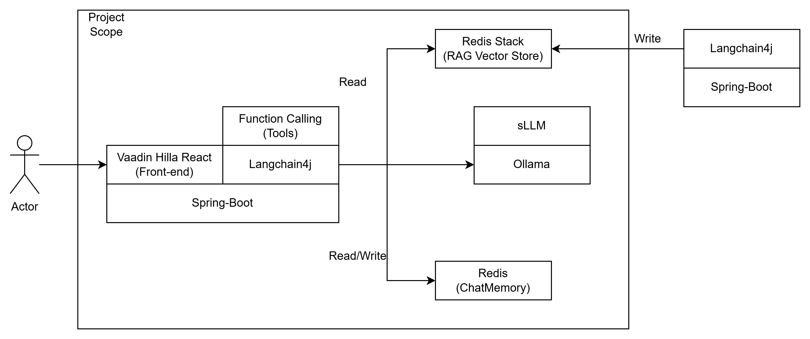

## Motivation
### Chatbot with Langchain4j
https://javaetmoi.com/2024/11/integrer-un-chatbot-dans-une-webapp-java-avec-langchain4j/

### 1. Introduction
- Chatbot Backend System have been using Spring boot with Langchain4j to communicate with the backend Ollama local AI system docker container.
- In order to enhance answer, application is used Langchain4j Tool(Function Calling) and RAG (Retrieval Augmented Generation/https://docs.langchain4j.dev/tutorials/rag#easy-rag).
- Because Some models such as EXAONE are not supported Tools.
- Queries should be routed to the appropriate RAG document.
- However, Combining Tools and RAG is hard to develop. so, it is not fully implemented yet. It is under development.(12/18/2024)

### 2. Frameworks
- Spring Boot
- Langchain4j
- Vaadin Hilla React (Frontend)
- Lombok
- JUnit

### 3. Architecture Diagram
- 

### 4. ollama-0.5.5-linux-amd64.tgz download page
```
https://github.com/ollama/ollama/releases
```

### 5. Docker container creation and execution command
```
docker-compose build --no-cache
docker build -t demo-chatbot:local .  && docker run -p 9090:8080  -e"SPRING_PROFILES_ACTIVE=exaone" -e"APPLICATION_PDF=pdf"  demo-chatbot:local
docker build -t ollama-gpu:local -f Dockerfile_ollama . && docker run --gpus=all -p 11435:11434 ollama-gpu:local
docker build -t trunk-pytorch:local -f Dockerfile_pytorch . && docker run --gpus=all trunk-pytorch:local
docker build -t trunk-pytorch:local -f Dockerfile_pytorch . && docker run -e TERM=xterm --tty  --gpus=all trunk-pytorch:local
docker build -t redis:local -f Dockerfile_redis . && docker run -p 7379:6379 redis:local
docker build -t llama_cpp:local -f ./Dockerfile_llama_cpp .  && docker run --gpus=all llama_cpp:local
docker build -t redis-stack:local -f Dockerfile_redisStack . && docker run -p 8379:6379 redis-stack:local 
```

### 6. Additional information
```
https://github.com/Donggeun10/llm-chatbot/wiki/Docker-container-with-GPU-in-Windows
https://github.com/Donggeun10/llm-chatbot/wiki/Private-LLM-Chatbot-application-with-RAG-and-Tools
```